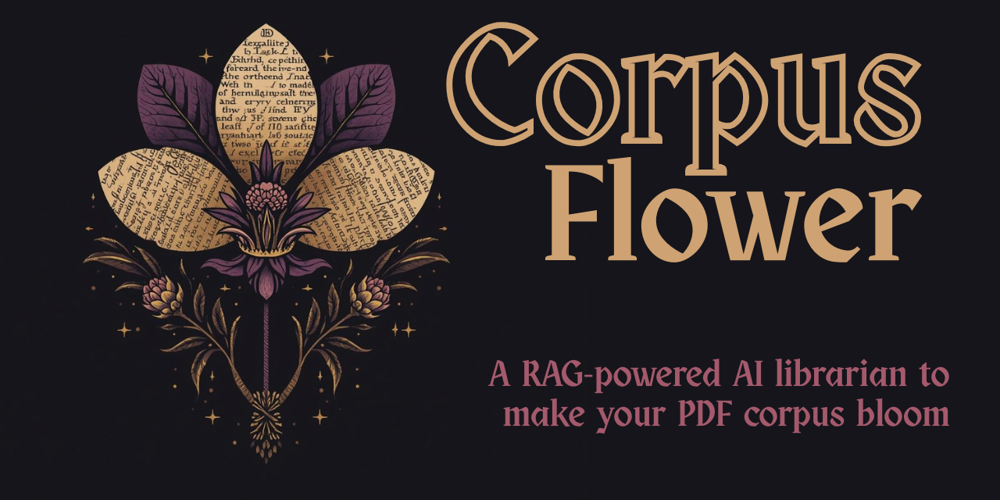

<p align="center">
  
</p>

# 📖🌸 **CorpusFlower**
### *Meaning that blooms from the text.*

CorpusFlower is a dark‑academia inspired concordance and retrieval engine that **illuminates meaning buried in large text corpora**.  
It ingests your PDFs, cultivates a semantic index, retrieves petals of context, and lets insight bloom through structured synthesis.

Designed for scholars, researchers, clergy, analysts, and contemplative readers, CorpusFlower turns a static corpus into a living garden of references, themes, and connections.

---

# ⭐ 1. The Story — *When the Corpus Begins to Bloom*

Imagine a desk covered in books and printed PDFs:

- marginalia in the margins  
- passages underlined three times  
- sticky notes marking “important” pages  
- a dozen different threads of meaning woven through thousands of lines  

You want to:

- find every occurrence of a key term  
- compare how a concept unfolds across chapters or authors  
- see context windows around each reference  
- ask natural‑language questions like “how does this corpus treat justice?”  
- gently surface motifs you didn’t know to look for  

But instead, you’re:

- scrolling endlessly through PDFs  
- searching one file at a time  
- losing your place  
- juggling tools and breaking your reading flow  

🌸 **CorpusFlower is built to change that.**

It treats your corpus as soil.  
It teases out roots (entities, terms, motifs),  
arranges petals of context (concordances and passages),  
and helps full blooms of interpretation emerge through targeted prompts and retrieval.

CorpusFlower is a **modern scriptorium engine** — text in, illuminated patterns out.

---

# ⭐ 2. What CorpusFlower Actually Does

At its core, CorpusFlower is a **modular concordance + RAG engine** for local PDFs:

### 🌱 Ingestion (StemParser)
- Walks your PDF directory  
- Extracts and normalizes text  
- Chunks into passages with gentle context‑aware boundaries  
- Stores structured JSON for downstream use  

### 🌿 Indexing (RootIndex)
- Embeds passages using OpenAI embeddings  
- Stores vectors in a local index on disk  
- Supports similarity search over the entire corpus  

### 🌸 Retrieval (PetalRetriever)
- Given a keyword or natural‑language query  
- Finds related passages by semantic similarity  
- Returns ranked petals of context for inspection  

### 🌼 Synthesis (BloomSynthesizer)
- Uses curated prompts to:
  - summarize passages  
  - extract themes  
  - compare usage across sections  
  - surface emergent motifs and interpretations  

### 🕯 Interface (Flask UI)
- Simple local web UI  
- Query your corpus  
- View concordances with context windows  
- Trigger summaries and exploratory analysis  

Everything is **local, transparent, and modifiable** — with a focus on readability and scholarly work.

---

# ⭐ 3. System Overview

```
PDFs
  │
  ▼
StemParser         (ingest, clean, chunk)
  │
  ▼
RootIndex          (embeddings + vector store)
  │
  ▼
PetalRetriever     (similarity + concordance)
  │
  ▼
BloomSynthesizer   (LLM-based synthesis)
  │
  ▼
Flask UI           (local research interface)
```

---

# ⭐ 4. Quickstart — *From Corpus to Garden*

### 4.1 Clone the repository

```bash
git clone https://github.com/<your-user>/corpusflower-rag-engine.git
cd corpusflower-rag-engine
```

### 4.2 Create and activate a virtual environment

```bash
python -m venv .venv

# Windows (PowerShell)
.venv\Scripts\Activate.ps1

# macOS / Linux
# source .venv/bin/activate
```

### 4.3 Install dependencies

```bash
pip install -r requirements.txt
```

### 4.4 Configure your environment

Create a `.env` file in `backend/`:

```env
OPENAI_API_KEY=sk-...
OPENAI_MODEL=gpt-4o-mini
OPENAI_EMBEDDING_MODEL=text-embedding-3-small
```

### 4.5 Add your PDFs

Place them in:

```
indexer/pdfs/
```

### 4.6 Ingest and index the corpus

```bash
python indexer/ingest_pdfs.py
```

### 4.7 Start the CorpusFlower app

```bash
python backend/main.py
```

Visit:  
👉 http://localhost:5001/

---

# ⭐ 5. Everyday Usage — *Letting Meaning Emerge*

### 🔍 Concordance‑style exploration  
- Search for a word or phrase  
- See all passages where it appears  
- Inspect left/right context for each occurrence  

### 💬 Natural‑language querying  
Ask questions like:

- “How is sacrifice described across this corpus?”  
- “Summarize every reference to covenant in these texts.”  
- “Compare how Author A and Author B treat the theme of exile.”  

### 🌸 Thematic blooms  
Use synthesis tools to:

- Summarize clusters of passages  
- Extract recurring motifs  
- Draft commentary  
- Generate outlines based on textual patterns  

---

# ⭐ 6. For Developers — Inside CorpusFlower

## 6.1 Project Layout

```
backend/       # Flask app, routing, prompts, retrieval logic
frontend/      # Templates / static assets
indexer/       # PDF ingestion + metadata
graph/         # Optional: graph‑based retrieval work
concordance/   # Concordance tooling
data/          # Local indexes (gitignored)
logs/          # Runtime logs
README.md
requirements.txt
.env
```

## 6.2 Key Modules

- `indexer/ingest_pdfs.py` — text extraction + chunking  
- `backend/retrieval.py` — embeddings + vector search  
- `backend/reasoning.py` — retrieval‑augmented reasoning  
- `backend/prompts.py` — synthesis + summary prompts  
- `backend/main.py` — Flask entrypoint  

This provides a complete, readable implementation of a RAG‑style concordance engine.

---

# ⭐ 7. Configuration & Environment

Common settings:

- `OPENAI_API_KEY` — required  
- `OPENAI_MODEL` — override for inference  
- `OPENAI_EMBEDDING_MODEL` — override for embeddings  

Optional custom paths:

- `CORPUSFLOWER_PDF_PATH`  
- `CORPUSFLOWER_INDEX_PATH`  

---

# ⭐ 8. Extending CorpusFlower

Potential extensions:

- Alternate vector stores (Qdrant, Chroma, pgvector)  
- Graph‑aware retrieval  
- Additional prompt styles  
- Analytics dashboards  
- Multi‑corpus support  

---

# ⭐ 9. Branding & Aesthetic

CorpusFlower is rooted in:

- dark‑academia  
- botanical metaphor  
- textual illumination  
- monastic study energy  

Use the provided palette:

- Ink Black  
- Vellum Ivory  
- Dried Rose  
- Botanical Green  
- Parchment Gold  
- Shadow Violet  

---

# ⭐ 10. License

```
MIT License

Copyright (c) 2025 Moses Shenassa

Permission is hereby granted, free of charge, to any person obtaining a copy
of this software...
```

---

# ⭐ 11. About the Author

Created by **Moses Shenassa** — developer, engineer, and builder of intelligent tools for knowledge, ritual, and transformation.

- Website: https://www.mosesshenassa.com  
- GitHub:  https://github.com/moses-shenassa  
- Email:   moses@hoodoomoses.com  

---

🌸 **Let the corpus bloom.**
